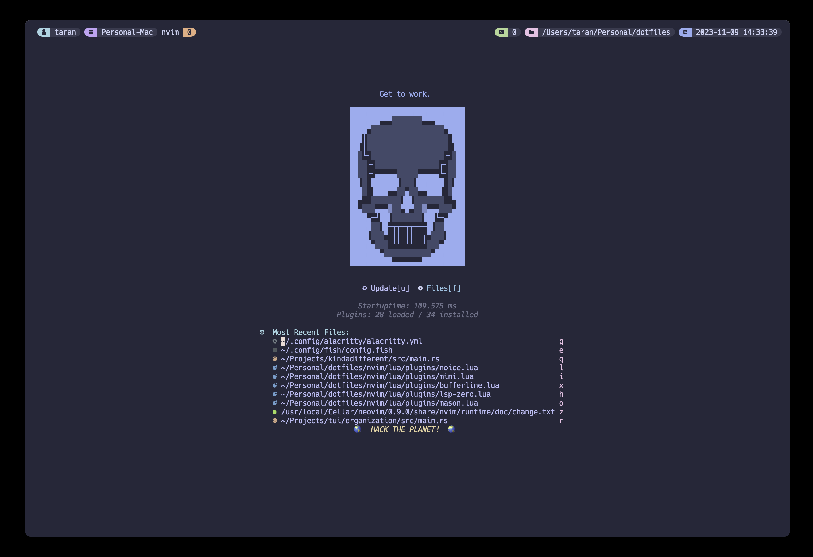

dotfiles
=========



nvim
===
Consult this site for information about the package manager:
https://github.com/folke/lazy.nvim (Optional)

Copy or link the nvim directory into `~/.config/nvim`

tmux
===
```
git clone https://github.com/tmux-plugins/tpm ~/.tmux/plugins/tpm
```
Copy or link the tmux directory into `~/.config/tmux`

Open tmux and run `prefix + I` to install TPM packages
