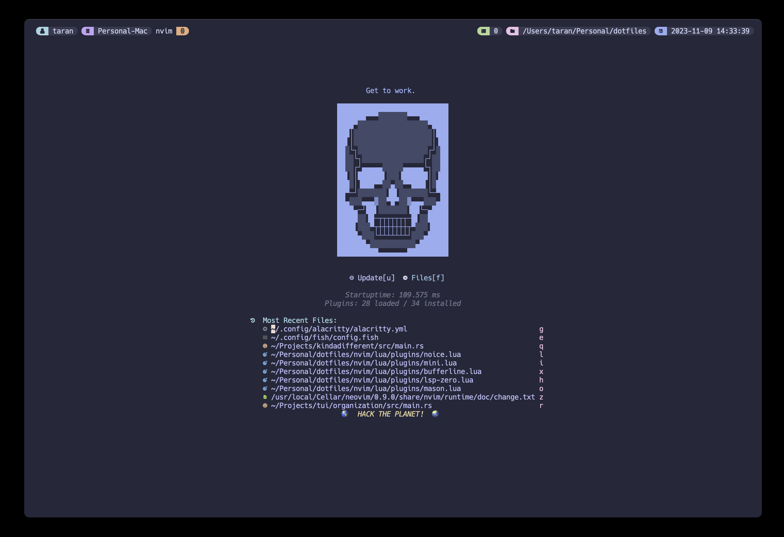

# dotfiles



## nvim

A Neovim configuration using [lazy.nvim](https://github.com/folke/lazy.nvim) as the plugin manager with the **Catppuccin Macchiato** color scheme and transparent background.

### Highlights

- **LSP** — LSP support via lsp-zero, mason, and nvim-lsp-config with auto-formatting
- **Completion** — nvim-cmp with LuaSnip snippets
- **Navigation** — Telescope, nvim-tree, oil.nvim, and vim-tmux-navigator
- **Git** — vim-fugitive and diffview.nvim
- **AI** — CodeCompanion and Ollama integration
- **UI** — lualine, noice, dashboard, indent-blankline, tint.nvim (dims inactive windows), and which-key
- **Editing** — treesitter, vim-surround, vim-commentary, undotree, trouble, nvim-ufo (folding), and zen mode
- **Org/Markdown** — orgmode, render-markdown, markdown-preview, and table-mode
- **Debugging** — nvim-dap

### Setup

Copy or symlink the `nvim` directory into `~/.config/nvim`:

```sh
ln -s /path/to/dotfiles/nvim ~/.config/nvim
```

Plugins will install automatically on first launch via lazy.nvim.

## tmux

### Setup

Install [TPM](https://github.com/tmux-plugins/tpm):

```sh
git clone https://github.com/tmux-plugins/tpm ~/.tmux/plugins/tpm
```

Copy or symlink the `tmux` directory into `~/.config/tmux`:

```sh
ln -s /path/to/dotfiles/tmux ~/.config/tmux
```

Open tmux and press `prefix + I` to install plugins.

## claude

Claude Code configuration and skills, split by context:

- **`claude/`** — personal skills
- **`claude-work/`** — work skills and settings

Each directory contains a `.claude/` folder with skills (and optionally `settings.json`). Use `--add-dir` to import them into a project:

```sh
claude --add-dir /path/to/dotfiles/claude-work
```

### Symlink settings

```sh
ln -sf /path/to/dotfiles/claude-work/.claude/settings.json ~/.claude/settings.json
```
