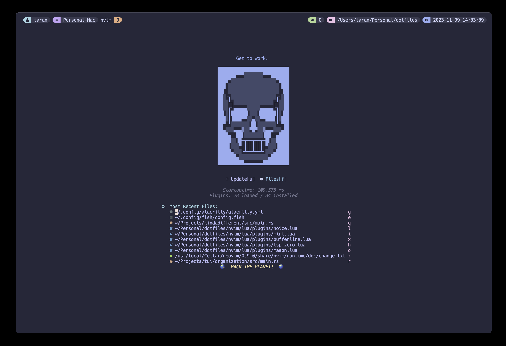

# dotfiles



## Install

```sh
git clone https://github.com/<you>/dotfiles ~/Personal/dotfiles
cd ~/Personal/dotfiles
./install.sh
```

`install.sh` installs the `Brewfile` packages, symlinks each config into `~/.config`, clones TPM, and starts the yabai and skhd services. It is safe to rerun: symlinks that already point at this repo are left alone, and nothing is ever deleted.

When a real file or directory already sits at a target path, the script stops and asks. Choosing **b** moves the existing path to `<name>.bak.<timestamp>` next to it and then links; choosing **s** leaves it untouched and reports it in the summary. Skills in `skills/` are confirmed one at a time, since they install at the user level in `~/.claude/skills` and apply to every project.

| Flag | Effect |
| --- | --- |
| `--dry-run` | Print what would happen, change nothing |
| `--backup-all` | Back up every conflict instead of prompting |
| `--skip-conflicts` | Leave every conflict untouched instead of prompting |
| `--all-skills` | Install every skill without asking |
| `--no-brew` | Skip `brew bundle` |
| `--no-services` | Skip starting yabai and skhd |

Without a terminal on stdin (piped or CI), conflicts and skills are skipped rather than guessed at.

What gets linked:

| Repo path | Target |
| --- | --- |
| `fish/` | `~/.config/fish` |
| `kitty/` | `~/.config/kitty` |
| `nvim/` | `~/.config/nvim` |
| `tmux/` | `~/.config/tmux` |
| `yabai/` | `~/.config/yabai` |
| `skhd/` | `~/.config/skhd` |
| `skills/<name>/` | `~/.claude/skills/<name>` |

The sections below describe each config and its manual setup, if you would rather not run the script.

## nvim

A Neovim configuration using [lazy.nvim](https://github.com/folke/lazy.nvim) as the plugin manager with the **Catppuccin Macchiato** color scheme and transparent background.

### Highlights

- **LSP** — LSP support via lsp-zero, mason, and nvim-lsp-config with auto-formatting
- **Completion** — nvim-cmp with LuaSnip snippets
- **Navigation** — Telescope, nvim-tree, oil.nvim, and vim-tmux-navigator
- **Git** — vim-fugitive and diffview.nvim
- **AI** — CodeCompanion and Ollama integration
- **UI** — lualine, noice, dashboard, indent-blankline, tint.nvim (dims inactive windows), and which-key
- **Editing** — treesitter, vim-surround, vim-commentary, undotree, trouble, nvim-ufo (folding), and zen mode
- **Org/Markdown** — orgmode, render-markdown, markdown-preview, and table-mode
- **Debugging** — nvim-dap

### Setup

Copy or symlink the `nvim` directory into `~/.config/nvim`:

```sh
ln -s /path/to/dotfiles/nvim ~/.config/nvim
```

Plugins will install automatically on first launch via lazy.nvim.

## tmux

### Setup

Install [TPM](https://github.com/tmux-plugins/tpm):

```sh
git clone https://github.com/tmux-plugins/tpm ~/.tmux/plugins/tpm
```

Copy or symlink the `tmux` directory into `~/.config/tmux`:

```sh
ln -s /path/to/dotfiles/tmux ~/.config/tmux
```

Open tmux and press `prefix + I` to install plugins.

## claude

Claude Code configuration and skills, split by context:

- **`claude/`** — personal skills
- **`claude-work/`** — work skills and settings

Each directory contains a `.claude/` folder with skills (and optionally `settings.json`). Use `--add-dir` to import them into a project:

```sh
claude --add-dir /path/to/dotfiles/claude-work
```

### Symlink settings

```sh
ln -sf /path/to/dotfiles/claude-work/.claude/settings.json ~/.claude/settings.json
```

## yabai + skhd

Tiling window manager ([yabai](https://github.com/koekeishiya/yabai)) with a hotkey daemon ([skhd](https://github.com/koekeishiya/skhd)) driving it.

### Install

Both come from the `asmvik/formulae` tap (a maintained fork of koekeishiya's, whose upstream skhd repo is archived). Recent Homebrew will not load formulae from a third-party tap until it is trusted:

```sh
brew tap asmvik/formulae
brew trust asmvik/formulae
brew install asmvik/formulae/yabai
brew install asmvik/formulae/skhd
```

### Setup

Symlink both config directories into `~/.config`:

```sh
ln -s /path/to/dotfiles/yabai ~/.config/yabai
ln -s /path/to/dotfiles/skhd ~/.config/skhd
```

`yabairc` must be executable:

```sh
chmod +x ~/.config/yabai/yabairc
```

Start the services:

```sh
yabai --start-service
skhd --start-service
```

On first run macOS will prompt for Accessibility permission — grant it to both `yabai` and `skhd` under **System Settings → Privacy & Security → Accessibility**, then restart the services:

```sh
yabai --restart-service
skhd --restart-service
```

These configs use only the base yabai API, so **disabling SIP is not required**. Partial SIP disablement plus the scripting addition is only needed for extras like window borders, focus-follows-mouse, and creating/destroying spaces.

### Config

`yabai/yabairc` — bsp layout, zero padding and gaps, new windows spawn as the first child (left on a vertical split, top on a horizontal one). Music and mpv are unmanaged; Music is also sticky.

`skhd/skhdrc` — vim-style bindings:

| Keys | Action |
| --- | --- |
| `alt - h/j/k/l` | Focus window west/south/north/east |
| `shift + alt - h/j/k/l` | Warp (move) window west/south/north/east |
| `alt - f` | Toggle float on the focused window |

### Troubleshooting

```sh
yabai --restart-service      # reload after editing yabairc
skhd --restart-service       # reload after editing skhdrc
tail -f /tmp/yabai_$USER.err.log
tail -f /tmp/skhd_$USER.err.log
```

If hotkeys stop working after a macOS update, re-grant Accessibility permission (remove and re-add the entries) and restart the services.
